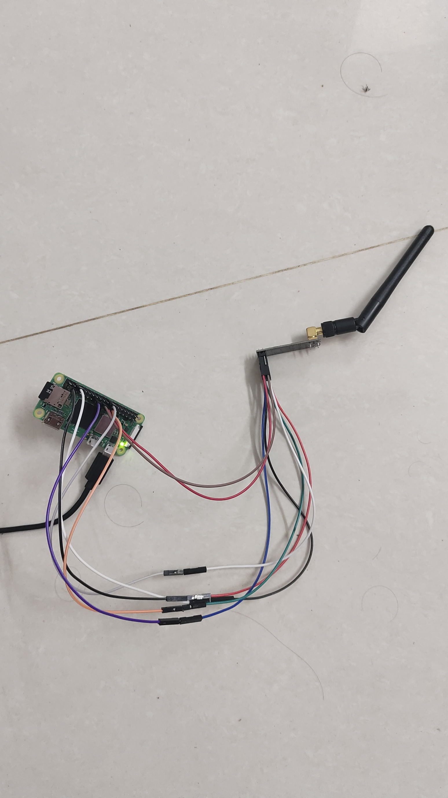

# RF24 Transmitter Example

This project demonstrates how to send a simple message from a Raspberry Pi zero 2 w to another device using the nRF24L01 radio module with the `RF24` library.

## Hardware Requirements

- **Raspberry Pi** (any model with GPIO pins)
- **nRF24L01+ Radio Module**
- Jumper wires
- External 3.3V power source (if necessary)

## Wiring the nRF24L01 to Raspberry Pi

| **nRF24L01 Pin** | **Raspberry Pi Pin** |
|------------------|----------------------|
| VCC              | 3.3V (Pin 1)         |
| GND              | GND (Pin 6)          |
| CE               | GPIO 22 (Pin 15)     |
| CSN              | GPIO 8 (CE0, Pin 24) |
| SCK              | GPIO 11 (Pin 23)     |
| MOSI             | GPIO 10 (Pin 19)     |
| MISO             | GPIO 9 (Pin 21)      |

<p align="center">

</p>
> **Note:** If you're using the nRF24L01+ module with an external antenna, ensure that it is powered appropriately (via a 3.3V regulator if necessary).

## Software Requirements

- **Raspberry Pi OS** (or any Linux distribution that supports the `RF24` library)
- **Python 3**
- **RF24 Python library**

You can install the required Python library using pip:

```bash
pip install RF24
